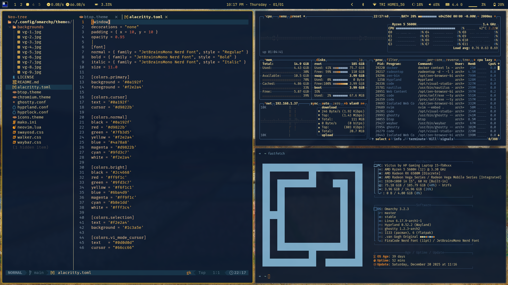

A theme inspired from van gogh's paintings and colors for [Omarchy.org](https://omarchy.org).

<p align="center">
  
</p>
<p align="center">
  
</p>
<p align="center">
  
</p>
<p align="center">
  
</p>
<p align="center">
  
</p>

## Installation

To install this theme:

```bash
omarchy-theme-install https://github.com/Nirmal314/omarchy-van-gogh-theme
```

## Neovim theme
[https://github.com/Nirmal314/van-gogh.nvim](https://github.com/Nirmal314/van-gogh.nvim)
