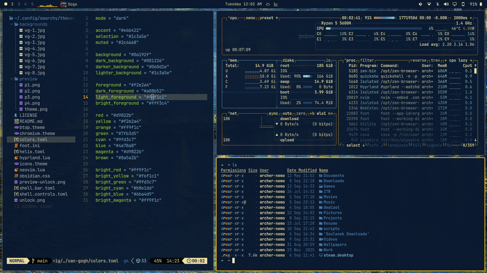
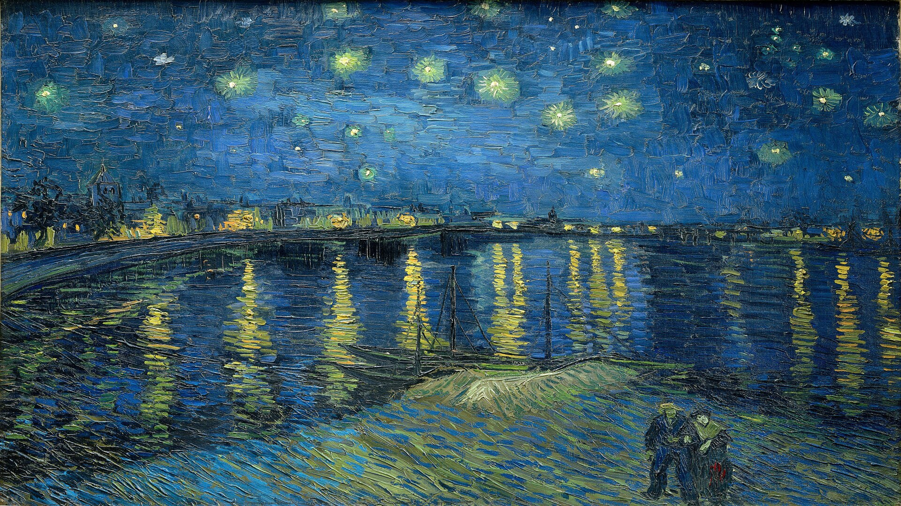
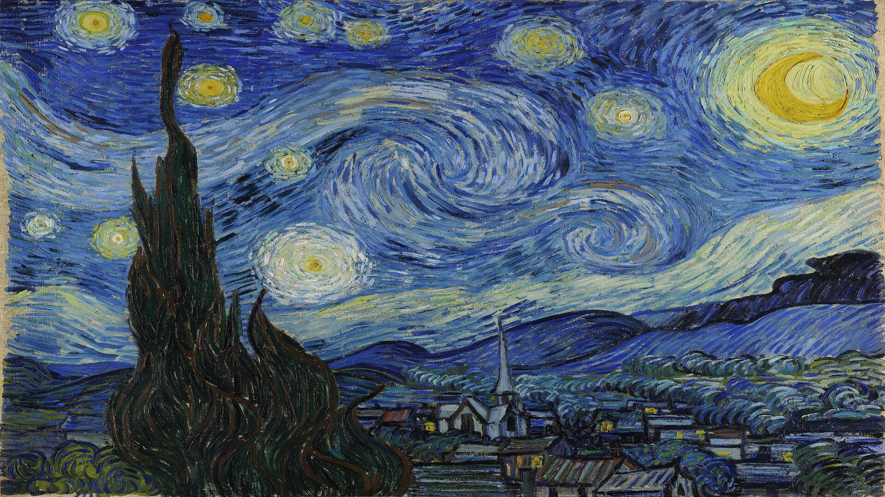
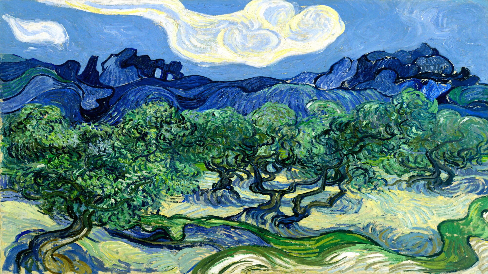
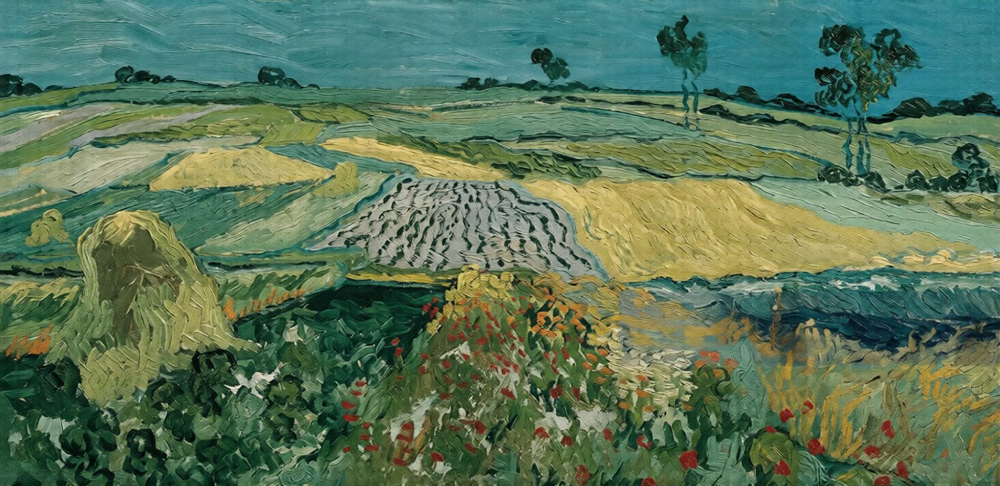
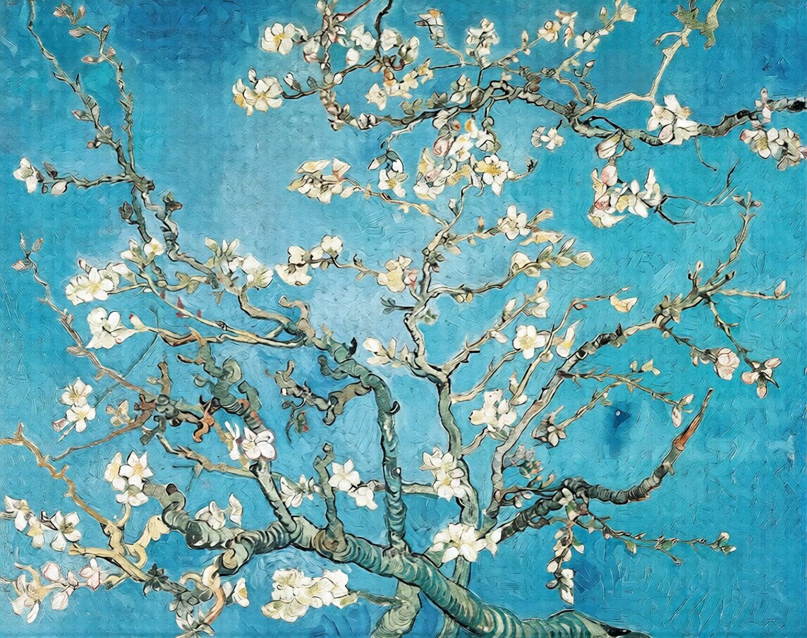
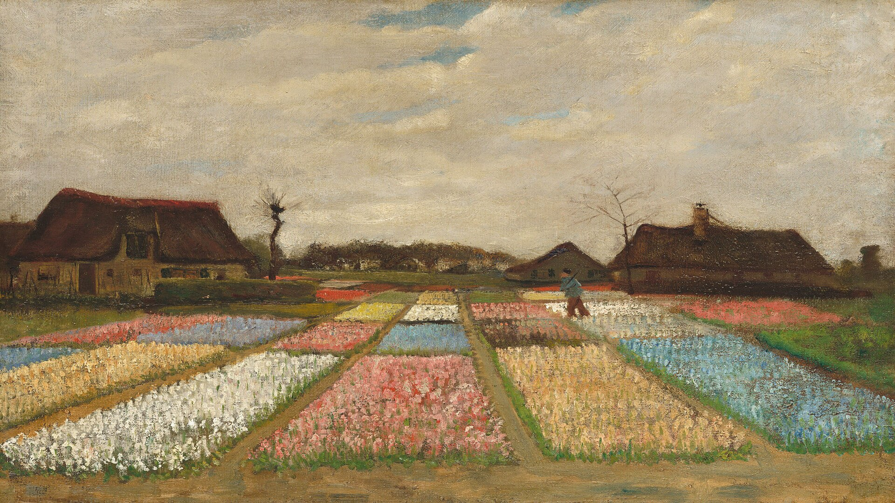
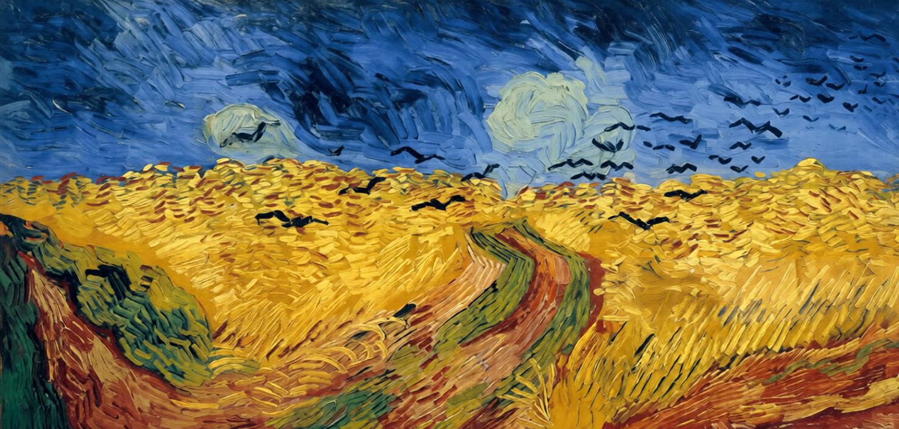
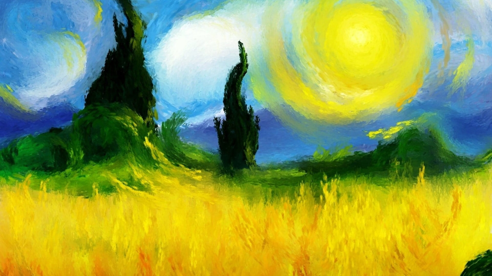

A dark theme for [Omarchy](https://omarchy.org), inspired by Vincent van Gogh's paintings and night-sky colors.

## Preview

<p align="center">
  
</p>
<p align="center">
  
</p>
<p align="center">
  
</p>
<p align="center">
  
</p>
<p align="center">
  
</p>

## Wallpapers

<p align="center">
  
  
  
  
</p>
<p align="center">
  
  
  
  
</p>

## Installation

To install this theme:

```bash
omarchy theme install https://github.com/Nirmal314/omarchy-van-gogh-theme
```

## Compatibility

This theme is designed for **Omarchy 4 (Quattro)** and includes configurations for:

- **Terminal Emulators**: Alacritty, Foot, Ghostty, Kitty
- **Window Manager**: Hyprland
- **Desktop Shell**: Omarchy Shell
- **Editors**: Neovim, Helix
- **System Monitor**: btop
- **Browser**: Chromium
- **Notes**: Obsidian

## Color Palette

<table>
  <tr>
    <td align="center"><br><sub>Background</sub><br><code>#0a192f</code></td>
    <td align="center"><br><sub>Lighter BG</sub><br><code>#1c3a5e</code></td>
    <td align="center"><br><sub>Selection</sub><br><code>#1c3a5e</code></td>
    <td align="center"><br><sub>Muted</sub><br><code>#2c4668</code></td>
    <td align="center"><br><sub>Foreground</sub><br><code>#f2e2a4</code></td>
    <td align="center"><br><sub>Accent</sub><br><code>#e6b422</code></td>
  </tr>
  <tr>
    <td align="center"><br><sub>Dark FG</sub><br><code>#a08b52</code></td>
    <td align="center"><br><sub>Light FG</sub><br><code>#f6f1c1</code></td>
    <td align="center"><br><sub>Bright FG</sub><br><code>#fff3c4</code></td>
    <td align="center"><br><sub>Red</sub><br><code>#d9822b</code></td>
    <td align="center"><br><sub>Green</sub><br><code>#7fb3d5</code></td>
    <td align="center"><br><sub>Yellow</sub><br><code>#f2e2a4</code></td>
  </tr>
  <tr>
    <td align="center"><br><sub>Magenta</sub><br><code>#d9822b</code></td>
    <td align="center"><br><sub>Cyan</sub><br><code>#9fd3c7</code></td>
    <td align="center"><br><sub>Bright Red</sub><br><code>#ff9f1c</code></td>
    <td align="center"><br><sub>Bright Green</sub><br><code>#9fd3c7</code></td>
    <td align="center"><br><sub>Bright Yellow</sub><br><code>#f6f1c1</code></td>
    <td align="center"><br><sub>Orange</sub><br><code>#ff9f1c</code></td>
  </tr>
</table>

## Neovim theme

[van-gogh.nvim](https://github.com/Nirmal314/van-gogh.nvim)
